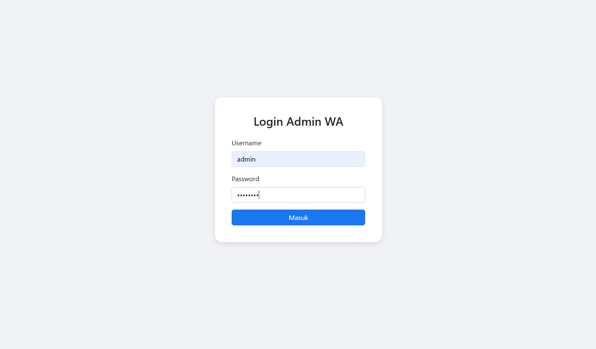
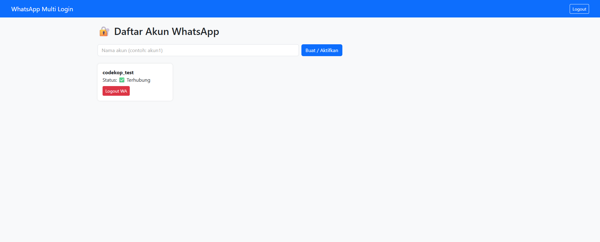

# 📲 Send WA API

API sederhana untuk mengirim pesan WhatsApp melalui sesi yang telah login, baik ke **grup** maupun **pribadi**, menggunakan token autentikasi JWT.

---

## 🔧 Setup

### 1. Clone & Install

```bash
git clone https://github.com/yourusername/send-wa-api.git
cd send-wa-api
npm install
```

### 2. Jalankan Server

```bash
node index.js
```

Server akan berjalan di `http://localhost:3000` (default port).

---

### 3. Konfigurasi JWT

Di file `index.js`, ubah sesuai keinginan:

```js
const JWT_SECRET = 'rahasia-super';
```

---

### 4. Buat Akun Admin Default

Pada `src/config/db.js`:

```js
const passwordPlain = 'admin123';
const passwordHashed = bcrypt.hashSync(passwordPlain, 10); // 10 = saltRounds
```

---

## 🔐 Autentikasi

### POST `/login`

Digunakan untuk mendapatkan token JWT.

#### Request:
```json
{
  "username": "admin",
  "password": "admin123"
}
```

#### Response (berhasil):
```json
{
  "token": "JWT_TOKEN_HERE"
}
```

---

## 🟢 Sesi WhatsApp

### ✅ Buat Session WhatsApp

**GET** `/create-session/:name`

##### Headers:
```
Authorization: Bearer <token>
Content-Type: application/json
```

- Membuat session baru dengan nama tertentu dan menghasilkan QR code jika belum login.

---

### 📄 Daftar Semua Session

**GET** `/sessions`

##### Headers:
```
Authorization: Bearer <token>
Content-Type: application/json
```

- Melihat semua sesi WhatsApp yang tersedia dan status koneksinya.

---

## 📤 Kirim Pesan

### ✉️ Kirim Pesan ke Nomor WhatsApp

**POST** `/send-message`

##### Headers:
```
Authorization: Bearer <token>
Content-Type: application/json
```

#### Request Body:
```json
{
  "name": "codekop_test",
  "number": "628xxxx",
  "message": "Halo dari API"
}
```

---

### 👥 Kirim Pesan ke Grup WhatsApp

#### 🔍 List Group

**GET** `/groups/:name`

##### Headers:
```
Authorization: Bearer <token>
Content-Type: application/json
```

#### 🚀 Kirim Pesan Grup

**POST** `/send-group`

##### Headers:
```
Authorization: Bearer <token>
Content-Type: application/json
```

##### Body:
```json
{
  "name": "codekop_test",
  "groupJid": "1234567890-xxxx@g.us",
  "message": "Halo Gais ini dari API"
}
```

---

## 🚪 Logout WhatsApp

**GET** `/logout-wa/:name`

##### Headers:
```
Authorization: Bearer <token>
Content-Type: application/json
```

Digunakan untuk mengakhiri sesi WhatsApp.

---

## 📸 Tampilan Fitur

### 🟡 Login Page


### 🟢 Dashboard


---

## 📝 Catatan

- Pastikan session `name` sudah aktif (login & QR sudah discan).
- Untuk mendapatkan `groupJid`, gunakan endpoint `GET /groups/:name`.
- Jika session belum aktif, gunakan endpoint `/create-session/:name`.

---

**Author:** `codekop`